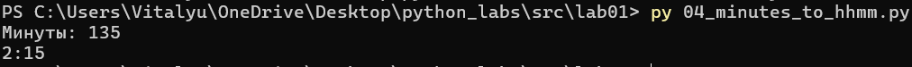
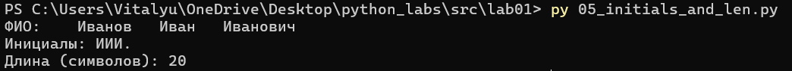
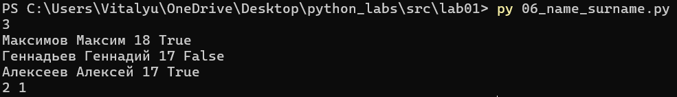
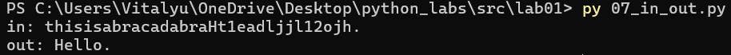
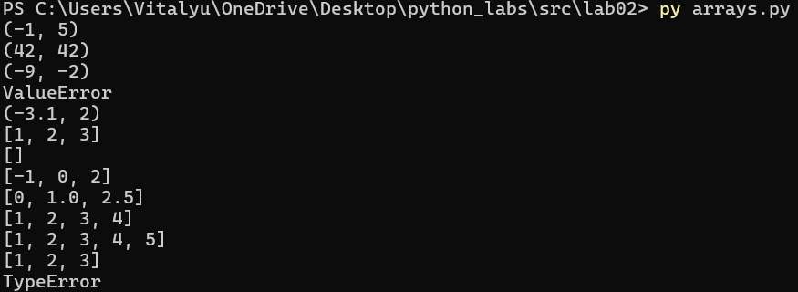
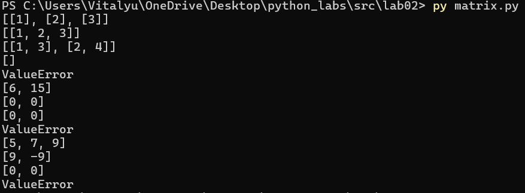

# python_labs
## **ЛР1 — Ввод/вывод и форматирование**
### Задание 1
```python
name = input('Имя: ')
age = int(input('Возраст: '))
print(f'Привет, {name}! Через год тебе будет {age+1}.')
```

### Задание 2
```python
a = float(input('a: ').replace(',', '.'))
b = float(input('b: ').replace(',', '.'))
summ = a+b
avg = round(summ/2,2)
print(f'sum={round(summ,2)}; avg={avg}')
```

### Задание 3
```python
price = float(input('price='))
discount = float(input('discount='))
vat = float(input('vat='))

base = price * (1 - discount/100)
vat_amount = base * (vat/100)
total = base + vat_amount

print(f'База после скидки: {base:.2f} ₽')
print(f'НДС:               {vat_amount:.2f} ₽')
print(f'Итого к оплате:    {total:.2f} ₽')
```

### Задание 4
```python
minutes = int(input('Минуты: '))
hours = minutes//60
minutes = minutes%60
print(f'{hours}:{minutes:02d}')
```

### Задание 5
```python
fio = input('ФИО: ')
fio = ' ' + fio
initials = ''.join([fio[x].upper() for x in range(1, len(fio)) if fio[x].isalpha() and  not fio[x-1].isalpha()])
len_fio = len([x for x in fio if x != ' '])+2
print(f'Инициалы: {initials}.')
print(f'Длина (символов): {len_fio}')
```

### Задание 6
```python
n = int(input())
a = 0
b = 0
for i in range(n):
    user = input()
    if user[-5:] == 'False': b += 1
    if user[-4:] == 'True': a += 1
print(a,b)
```

### Задание 7
```python
in0 = input('in: ')
out = ''
first_letter = 0
for i in in0:
    if i.isupper():
        out += i
        first_letter = in0.index(i)
        break
in1 = in0[first_letter:]
flag = False
for i in in1:
    if flag:
        out += i
        difference = in0.index(i)-first_letter
        break
    if i.isdigit():
        flag = True
in2 = in1[difference:]
for i in range(len(in2)):
    if i%difference == 0 and i!=0:
        out+=in2[i]  
print(f'out: {out}')
```


## **ЛР2 — Коллекции и матрицы (list/tuple/set/dict)**
### Задание 1
```python
def min_max(user_list):
    """
    Находит минимальный и максимальный элемент списка чисел
    In: принимает от пользователя list[float | int] (проверяет, действительно ли введен список)
    Out: возвращает tuple[float | int, float | int] - с минимальным и максимальным числом;
    Возвращает ошибку ValueError в случае некорректного ввода 
    """
    if not isinstance(user_list, list):
        return 'ValueError'
    try:
        min_el = min(user_list)
        max_el = max(user_list)
        return tuple([min_el, max_el])
    except ValueError:
        return 'ValueError'     
test_data_mm = [[3, -1, 5, 5, 0], [42], [-5, -2, -9], [], [1.5, 2, 2.0, -3.1]]
for test in test_data_mm:
    print(min_max(test))

def unique_sorted(user_list):
    """
    Сортирует список по возрастанию, сохраняя только уникальные элементы
    In: принимает от пользователя list[float | int] (проверяет, действительно ли введен список)
    Out: возвращает list[float | int] c отсортированными уникальными элементами;
    Возвращает ошибку ValueError в случае некорректного ввода 
    """
    if not isinstance(user_list, list):
            return 'ValueError'
    return sorted(list(set(user_list)))
test_data_us = [[3, 1, 2, 1, 3], [], [-1, -1, 0, 2, 2], [1.0, 1, 2.5, 2.5, 0]]
for test in test_data_us:
    print(unique_sorted(test))

def flatten(user_list):
    """
    Разворачивает список списков/кортежей в один плоский список (row-major order)
    In: принимает от пользователя list[list | tuple] (проверяет, действительно ли введен список со списками и кортежами)
    Out: Возвращает 'расплющенный' список с элементами из вложенных кортежей/списков;
    Возвращает ошибку TypeError в случае некорректного ввода
    """
    out_list = []
    try:
        for list_i in user_list:
            if isinstance(list_i, tuple) or isinstance(list_i, list):
                for element in list_i:
                    out_list.append(element)
            else: raise TypeError
        return out_list
    except TypeError:
        return 'TypeError'
test_data_f = [[[1, 2], [3, 4]], [[1, 2], (3, 4, 5)], [[1], [], [2, 3]], [[1, 2], "ab"]]
for test in test_data_f:
    print(flatten(test))
```

### Задание 2
 ```python
 def transpose(matrix):
    """
    Реализует транспонирование матрицы
    In: принимает от пользователя list[list[float | int]] (проверяет, действительно ли введен список)
    Out: возвращает list[list] - транспонированную матрицу;
    Возвращает ValueError в случае некорректного ввода
    """
    if not isinstance(matrix, list):
            return 'ValueError'
    if len(matrix) > 0:
        rows = len(matrix[0])
        t_matrix = []
    else: return '[]'
    try:
        for number_element in range(rows):
            new_row = []
            for row in matrix:
                new_row.append(row[number_element])
            t_matrix.append(new_row)
        return t_matrix
    except IndexError:
        return 'ValueError'
test_data_t = [[[1, 2, 3]], [[1], [2], [3]], [[1, 2], [3, 4]], [], [[1, 2], [3]]]
for test in test_data_t:
    print(transpose(test))

def row_sums(user_list):
    """
    Находит сумму по каждой строке матрицы
    In: принимает от пользователя list[list[float | int]] (проверяет, действительно ли введен список)
    Out: возвращает list[float] - список с суммами по строкам;
    Возвращает ValueError в случае некорректного ввода
    """
    if not isinstance(user_list, list):
            return 'ValueError'
    list_with_sum = []
    len_row = len(user_list[0])
    try:
        for row in range(len(user_list)):
            sum_row = 0
            for ind in range(len_row):
                sum_row += user_list[row][ind]
            list_with_sum.append(sum_row)
        return list_with_sum
    except IndexError:
        return 'ValueError'
test_data_rs = [[[1, 2, 3], [4, 5, 6]], [[-1, 1], [10, -10]], [[0, 0], [0, 0]], [[1, 2], [3]]]
for test in test_data_rs:
    print(row_sums(test))

def col_sums(user_list):
    """
    Находит сумму по каждому столбцу матрицы
    In: принимает от пользователя list[list[float | int]] (проверяет, действительно ли введен список)
    Out: возвращает list[float] - список с суммами по столбцам;
    Возвращает ValueError в случае некорректного ввода
    """
    if not isinstance(user_list, list):
            return 'ValueError'
    list_with_sum = []
    len_row = len(user_list[0])
    try:
        for ind in range(len_row):
            sum_col = 0
            for row in range(len(user_list)):          
                sum_col += user_list[row][ind]
            list_with_sum.append(sum_col)
        return list_with_sum
    except IndexError:
        return 'ValueError'
test_data_cs = [[[1, 2, 3], [4, 5, 6]], [[-1, 1], [10, -10]], [[0, 0], [0, 0]], [[1, 2], [3]]]
for test in test_data_rs:
    print(col_sums(test))
```
