# python_labs
## **Лаба №1**
### Задание 1
```
name = input('Имя: ')
age = int(input('Возраст: '))
print(f'Привет, {name}! Через год тебе будет {age+1}.')
```
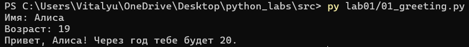
### Задание 2
```
a = float(input('a: ').replace(',', '.'))
b = float(input('b: ').replace(',', '.'))
summ = a+b
avg = round(summ/2,2)
print(f'sum={round(summ,2)}; avg={avg}')
```
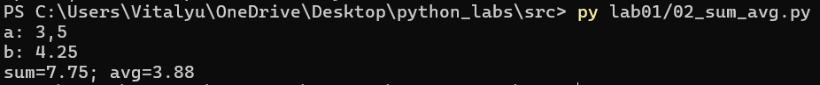
### Задание 3
```
price = float(input('price='))
discount = float(input('discount='))
vat = float(input('vat='))

base = price * (1 - discount/100)
vat_amount = base * (vat/100)
total = base + vat_amount

print(f'База после скидки: {base:.2f} ₽')
print(f'НДС:               {vat_amount:.2f} ₽')
print(f'Итого к оплате:    {total:.2f} ₽')
```
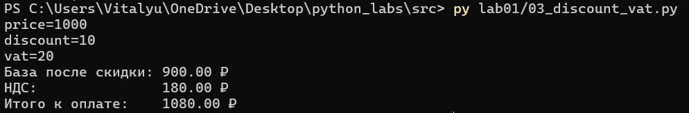
### Задание 4
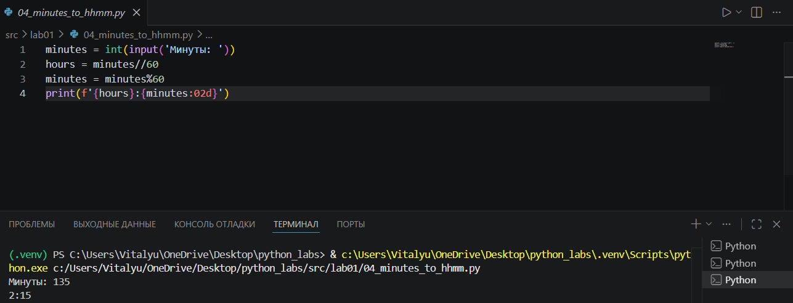
### Задание 5
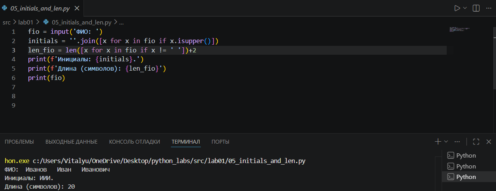
### Задание 6
.png>)
### Задание 7
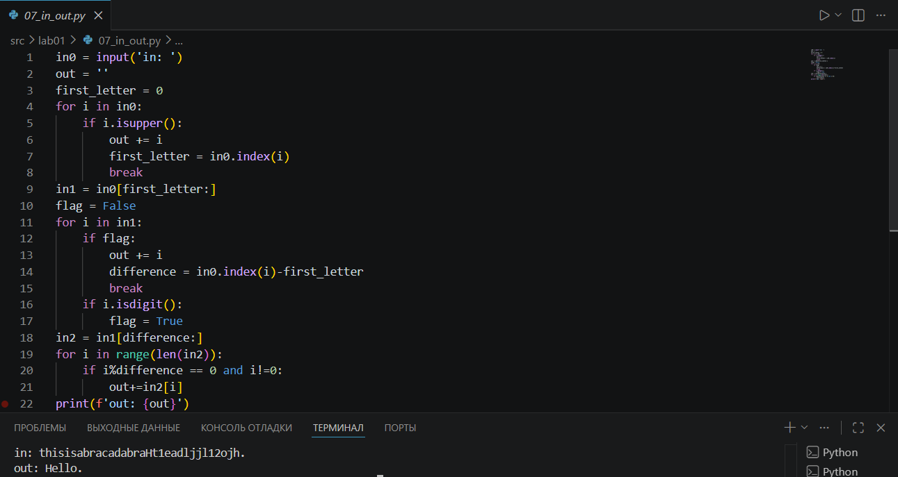

## **Лаба №2**
### Задание 1
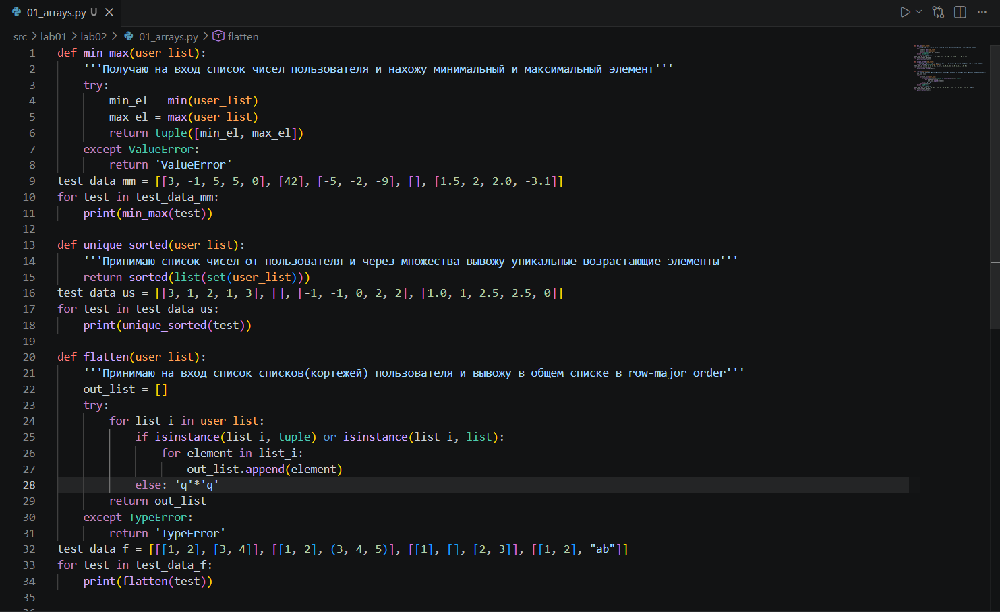
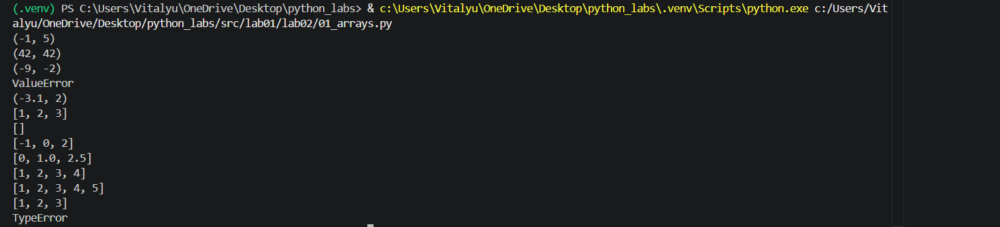
### Задание 2
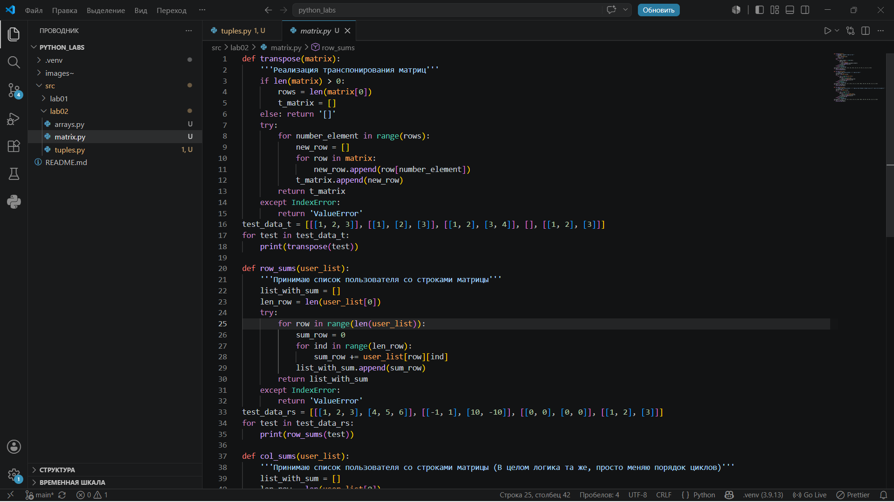 
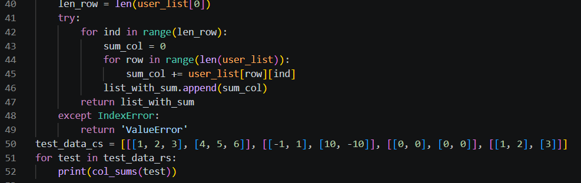 
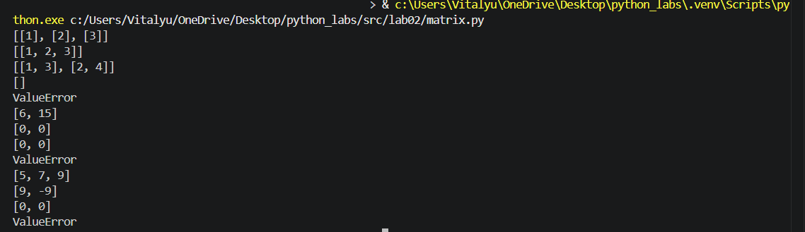