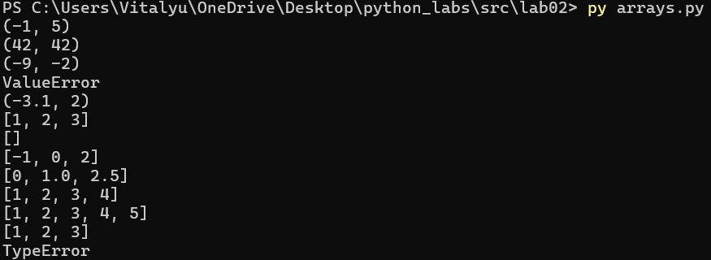
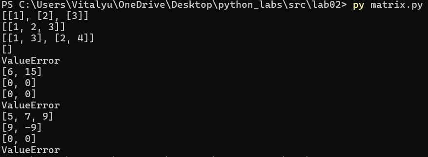
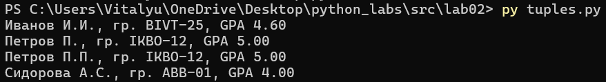

# **ЛР2 — Коллекции и матрицы (list/tuple/set/dict)**
## Задание 1
```python
def min_max(user_list):
    """
    Находит минимальный и максимальный элемент списка чисел
    In: принимает от пользователя list[float | int] (проверяет, действительно ли введен список)
    Out: возвращает tuple[float | int, float | int] - с минимальным и максимальным числом;
    Возвращает ошибку ValueError в случае некорректного ввода 
    """
    if not isinstance(user_list, list):
        return 'ValueError'
    try:
        min_el = max_el = user_list[0]
        for el in user_list:
            if el < min_el: min_el = el
            if el > max_el: max_el = el
        return tuple([min_el, max_el]) 
    except IndexError:
        return 'ValueError'     
test_data_mm = [[3, -1, 5, 5, 0], [42], [-5, -2, -9], [], [1.5, 2, 2.0, -3.1]]
for test in test_data_mm:
    print(min_max(test))

def unique_sorted(user_list):
    """
    Сортирует список по возрастанию, сохраняя только уникальные элементы
    In: принимает от пользователя list[float | int] (проверяет, действительно ли введен список)
    Out: возвращает list[float | int] c отсортированными уникальными элементами;
    Возвращает ошибку ValueError в случае некорректного ввода 
    """
    if not isinstance(user_list, list):
            return 'ValueError'
    user_list = list(set(user_list))
    sorted_user_list = [10**10]
    for user_digit in user_list:
        for place in range(len(sorted_user_list)):
            if user_digit < sorted_user_list[place]: 
                sorted_user_list.insert(place, user_digit)
                break
    return sorted_user_list[:-1]
test_data_us = [[3, 1, 2, 1, 3], [], [-1, -1, 0, 2, 2], [1.0, 1, 2.5, 2.5, 0]]
for test in test_data_us:
    print(unique_sorted(test))

def flatten(user_list):
    """
    Разворачивает список списков/кортежей в один плоский список (row-major order)
    In: принимает от пользователя list[list | tuple] (проверяет, действительно ли введен список со списками и кортежами)
    Out: Возвращает 'расплющенный' список с элементами из вложенных кортежей/списков;
    Возвращает ошибку TypeError в случае некорректного ввода
    """
    out_list = []
    try:
        for list_i in user_list:
            if isinstance(list_i, tuple) or isinstance(list_i, list):
                for element in list_i:
                    out_list.append(element)
            else: raise TypeError
        return out_list
    except TypeError:
        return 'TypeError'
test_data_f = [[[1, 2], [3, 4]], [[1, 2], (3, 4, 5)], [[1], [], [2, 3]], [[1, 2], "ab"]]
for test in test_data_f:
    print(flatten(test))
```

## Задание 2
 ```python
 def transpose(matrix):
    """
    Реализует транспонирование матрицы
    In: принимает от пользователя list[list[float | int]] (проверяет, действительно ли введен список)
    Out: возвращает list[list] - транспонированную матрицу;
    Возвращает ValueError в случае некорректного ввода
    """
    if not isinstance(matrix, list):
            return 'ValueError'
    if len(matrix) > 0:
        rows = len(matrix[0])
        t_matrix = []
    else: return '[]'
    try:
        for number_element in range(rows):
            new_row = []
            for row in matrix:
                new_row.append(row[number_element])
            t_matrix.append(new_row)
        return t_matrix
    except IndexError:
        return 'ValueError'
test_data_t = [[[1, 2, 3]], [[1], [2], [3]], [[1, 2], [3, 4]], [], [[1, 2], [3]]]
for test in test_data_t:
    print(transpose(test))

def row_sums(user_list):
    """
    Находит сумму по каждой строке матрицы
    In: принимает от пользователя list[list[float | int]] (проверяет, действительно ли введен список)
    Out: возвращает list[float] - список с суммами по строкам;
    Возвращает ValueError в случае некорректного ввода
    """
    if not isinstance(user_list, list):
            return 'ValueError'
    list_with_sum = []
    len_row = len(user_list[0])
    try:
        for row in range(len(user_list)):
            sum_row = 0
            for ind in range(len_row):
                sum_row += user_list[row][ind]
            list_with_sum.append(sum_row)
        return list_with_sum
    except IndexError:
        return 'ValueError'
test_data_rs = [[[1, 2, 3], [4, 5, 6]], [[-1, 1], [10, -10]], [[0, 0], [0, 0]], [[1, 2], [3]]]
for test in test_data_rs:
    print(row_sums(test))

def col_sums(user_list):
    """
    Находит сумму по каждому столбцу матрицы
    In: принимает от пользователя list[list[float | int]] (проверяет, действительно ли введен список)
    Out: возвращает list[float] - список с суммами по столбцам;
    Возвращает ValueError в случае некорректного ввода
    """
    if not isinstance(user_list, list):
            return 'ValueError'
    list_with_sum = []
    len_row = len(user_list[0])
    try:
        for ind in range(len_row):
            sum_col = 0
            for row in range(len(user_list)):          
                sum_col += user_list[row][ind]
            list_with_sum.append(sum_col)
        return list_with_sum
    except IndexError:
        return 'ValueError'
test_data_cs = [[[1, 2, 3], [4, 5, 6]], [[-1, 1], [10, -10]], [[0, 0], [0, 0]], [[1, 2], [3]]]
for test in test_data_rs:
    print(col_sums(test))
```

## Задание №3
```python
def format_record(user_tuple):
    """
    Реализует необходимую функцию, преобразующую кортеж в строку установленного вида
    In: принимает от пользователя tuple[str, str, float] (проверяет, действительно ли введен кортеж)
    Out: возвращает str - строку с информацией о студенте;
    Возвращает ошибку ValueError в случае некорректного ввода(неверный тип GPA, пустое ФИО, пустая группа) 
    """
    if not isinstance(user_tuple, tuple):
        return 'ValueError'
    try:
        fio = user_tuple[0]
        group = user_tuple[1]
        gpa = user_tuple[2]
        if len(user_tuple) > 3:
            raise ValueError
        # Обработка ФИО
        name_surname_fat = fio.split()
        if len(name_surname_fat) == 3: fio = name_surname_fat[0][0].upper() + name_surname_fat[0][1:] + ' ' + name_surname_fat[1][0].upper() + '.' + name_surname_fat[2][0].upper() +'.'
        else: fio = name_surname_fat[0] + ' ' + name_surname_fat[1][0].upper() + '.'
        # Обработка группы
        if len(group) == 0:
            raise ValueError
        group = 'гр. ' + group
        # Обработка GPA
        if int(gpa) > 5 or int(gpa) < 0:
            raise ValueError
        gpa = f'GPA {gpa:.2f}'
        return fio + ', ' + group + ', ' + gpa
    except IndexError:
        return "ValueError"
data = [("Иванов Иван Иванович", "BIVT-25", 4.6), ("Петров Пётр", "IKBO-12", 5.0), ("Петров Пётр Петрович", "IKBO-12", 5.0), ("  сидорова  анна   сергеевна ", "ABB-01", 3.999)]
for test in data:
    try: print(format_record(test))
    except ValueError: print('ValueError')
```
