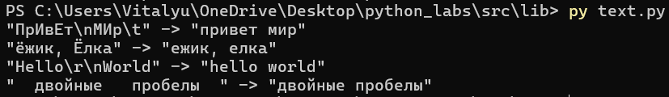
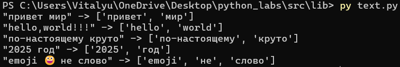
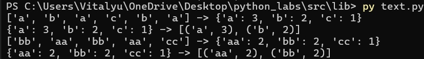
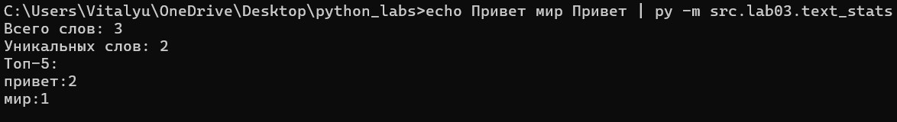
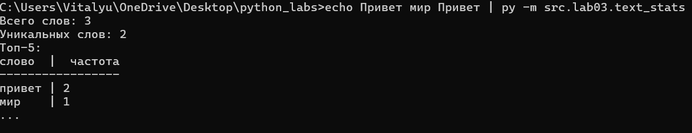
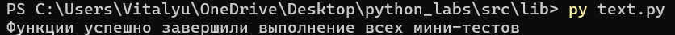

# **ЛР3 — Тексты и частоты слов (словарь/множество)**
## Задание A — `src/lib/text.py`
### `normalize`
```python
def normalize(text: str, *, casefold: bool = True, yo2e: bool = True) -> str:
    '''
    Функция нормализует введенные текстовые данные
    Принимает на вход текстовые данные, две булевых переменных:
        casefold: True - приводит к casefold / False - использует lower()
        yo2e: True - заменяет Ё(ё) на Е(е) / False - оставляет Ё(ё)
    Возвращает текст приведенный к необходимому формату
    '''
    if casefold: text = text.casefold()
    else: text = text.lower()
    if yo2e: text = text.replace('ё', 'е')
    text = ' '.join(text.split())
    return text
```


### `tokenize`
```python
def tokenize(text: str) -> list[str]:
    '''
    Функция разбивает введенный текст по небуквенно-цифровым разделителям
    Принимает на вход текстовые данные
    Возвращает список со словами(последовательностями символов \w + [-] в сложных словах
    '''
    our_alphas = re.finditer(r'\w+(-\w+)*', text)
    words = []
    for alphas in our_alphas:
        words.append(alphas.group())
    return words
```


### `count-freq + top_n`
```python
def count_freq(tokens: list[str]) -> dict[str, int]:
    '''
    Функция считает частоты введенных значений в списке
    Принимает список с текстовыми элементами
    Возвращает словарь типа: {'елемент': частота появлений в списке}
    '''
    freq = dict()
    for element in tokens:
        if element not in freq: freq[element] = 1
        else: freq[element] += 1
    return dict(sorted(freq.items()))

def top_n(freq: dict[str, int], n: int = 5) -> list[tuple[str, int]]:
    '''
    Функция возвращает топ-N по убыванию частоты; при равенстве — по алфавиту слова
    Принимает словарь с элементами и их частотами, число N - количество возвращаемых ТОП-элементов
    Возвращает отсортрованный список ТОП-N элементов с кортежами
    '''
    freqs = sorted(freq.items(), key = lambda x: (-x[1], x[0]))[:n]
    return freqs
```


## Задание В - `src/text_stats.py`
```python
import sys
sys.stdin.reconfigure(encoding='utf-8')

from src.lib.text import normalize, tokenize, count_freq, top_n

'''
Меняет кодировку на utf-8 для корректной работы с входными данными через sys.stdin.reconfigure(encoding='utf-8')
Получает данные через sys.stdin.read() - текст
Возвращает общее количество слов в введенном тексте, количество уникальных слов;
и Топ-5 наиболее частых слов (при константе excel == True: красивый табличный вывод / excel == False: базовый вывод)
'''

excel = True

text = sys.stdin.read()
text = normalize(text)
tokens = tokenize(text)

print(f'Всего слов: {len(tokens)}')
print(f'Уникальных слов: {len(set(tokens))}')
print('Топ-5:')

if not excel:
    top = top_n(count_freq(tokens))
    for word, freq in top:
        print(f'{word}:{freq}')

if excel:
    top = top_n(count_freq(tokens))
    max_len = max(max([len(word[0]) for word in top])+1, 6)
    
    first_row = 'слово' + (max_len-5)*' ' + '|' +'  частота'
    print(first_row)
    print('-'*len(first_row))
    for word, freq in top:
            print(word + (max_len-len(word))*' ' + '| ' + str(freq))
    print('...')
```
**Входные данные: `"Привет, мир! Привет!!!"`**



## Общий код `src/lib/text.py` с проверкой на мини тестах

```python
import re

def normalize(text: str, *, casefold: bool = True, yo2e: bool = True) -> str:
    '''
    Функция нормализует введенные текстовые данные
    Принимает на вход текстовые данные, две булевых переменных:
        casefold: True - приводит к casefold / False - использует lower()
        yo2e: True - заменяет Ё(ё) на Е(е) / False - оставляет Ё(ё)
    Возвращает текст приведенный к необходимому формату
    '''
    if casefold: text = text.casefold()
    else: text = text.lower()
    if yo2e: text = text.replace('ё', 'е')
    text = ' '.join(text.split())
    return text

def tokenize(text: str) -> list[str]:
    '''
    Функция разбивает введенный текст по небуквенно-цифровым разделителям
    Принимает на вход текстовые данные
    Возвращает список со словами(последовательностями символов \w + [-] в сложных словах
    '''
    our_alphas = re.finditer(r'\w+(-\w+)*', text)
    words = []
    for alphas in our_alphas:
        words.append(alphas.group())
    return words

def count_freq(tokens: list[str]) -> dict[str, int]:
    '''
    Функция считает частоты введенных значений в списке
    Принимает список с текстовыми элементами
    Возвращает словарь типа: {'елемент': частота появлений в списке}
    '''
    freq = dict()
    for element in tokens:
        if element not in freq: freq[element] = 1
        else: freq[element] += 1
    return dict(sorted(freq.items()))

def top_n(freq: dict[str, int], n: int = 5) -> list[tuple[str, int]]:
    '''
    Функция возвращает топ-N по убыванию частоты; при равенстве — по алфавиту слова
    Принимает словарь с элементами и их частотами, число N - количество возвращаемых ТОП-элементов
    Возвращает отсортрованный список ТОП-N элементов с кортежами
    '''
    freqs = sorted(freq.items(), key = lambda x: (-x[1], x[0]))[:n]
    return freqs

'''
Контрольные мини-тесты
'''
# normalize
assert normalize("ПрИвЕт\nМИр\t") == "привет мир"
assert normalize("ёжик, Ёлка") == "ежик, елка"

# tokenize
assert tokenize("привет, мир!") == ["привет", "мир"]
assert tokenize("по-настоящему круто") == ["по-настоящему", "круто"]
assert tokenize("2025 год") == ["2025", "год"]

# count_freq + top_n
freq = count_freq(["a","b","a","c","b","a"])
assert freq == {"a":3, "b":2, "c":1}
assert top_n(freq, 2) == [("a",3), ("b",2)]

# тай-брейк по слову при равной частоте
freq2 = count_freq(["bb","aa","bb","aa","cc"])
assert top_n(freq2, 2) == [("aa",2), ("bb",2)]

print('Функции успешно завершили выполнение всех мини-тестов!')

```
